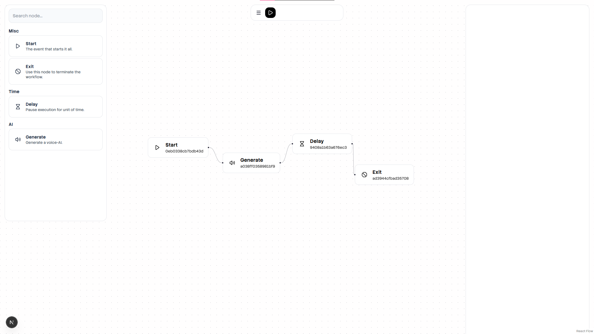

# [Work-in-progress] Autoflows

A framework/library to build embeddable Workflows for your web-app quickly.

```ts
// shared/schema.ts

export const Start = new Node(
  {
    options: { name: "Start", label: "Start", description: "The event that starts it all." },
    schema: {
      output: [],
      input: [],
    }
  },
);

export const Exit = new Node(
  {
    options: { name: "Exit", label: "Exit", description: "Use this node to terminate the workflow." },
    schema: {
      output: [],
      input: [],
    }
  },
);

export const Mailer = new Node(
  {
    options: { name: "Mail", label: "Mail", description: "Send an E-mail." },
    schema: {
      output: [],
      input: [],
    }
  },
);
```

```ts
// server/index.ts
import { Start, Exit, Mailer }from "shared/schema.ts"

// Server-side Virtual Machine...
const autoflows = new Autoflows()
  .define(Start, {
    onAct: (data) => { }
  })
  .define(Mailer, {
    onAct: (data) => { }
  });
  .define(Exit, {
    onAct: (data) => { }
  });
```

```ts
import { Start, Exit, Mailer }from "shared/schema.ts"

// Client-side (React) builder.
  const builder = new AutoflowsBuilder()
    .add(Start)
    .add(Exit)
    .add(Mailer)
```



## Contribution

- Entrypoint directory starts at `/src`
- For client-side testing use `cd test` followed by `npm run dev`.

## Roadmap

- [ ] Clean, embeddable, extendable UI-interface.
- [ ] APIs to implement custom Custom Server-logic.
- [ ] Workflow saving and tracking (database).
- [ ] Reliable (type-validated) data passing between nodes.